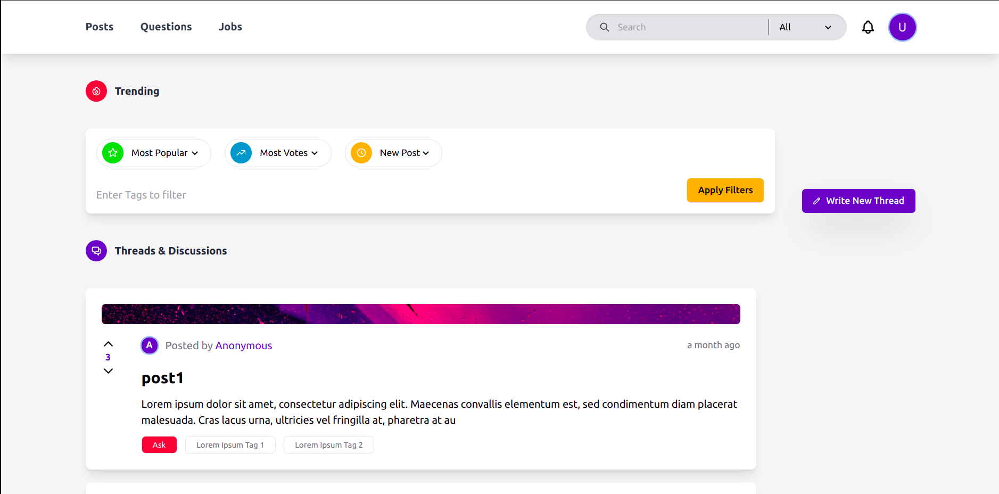
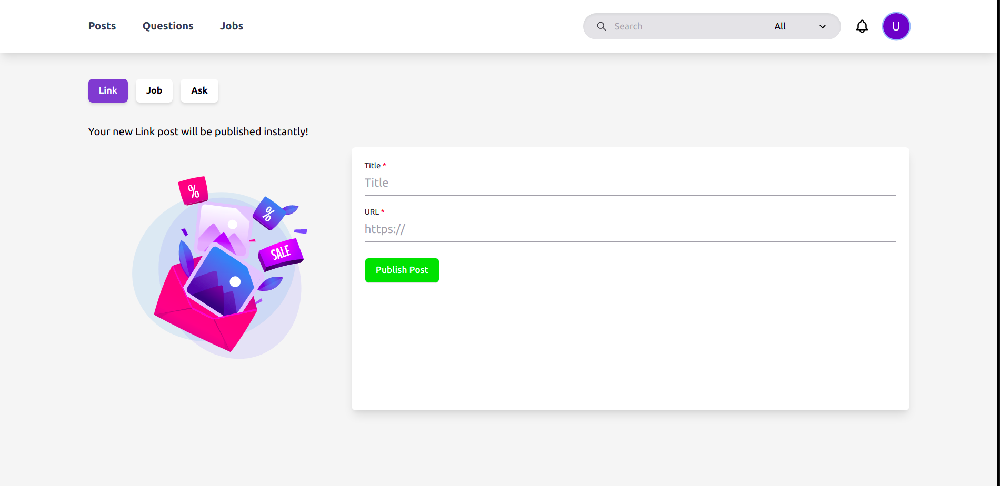
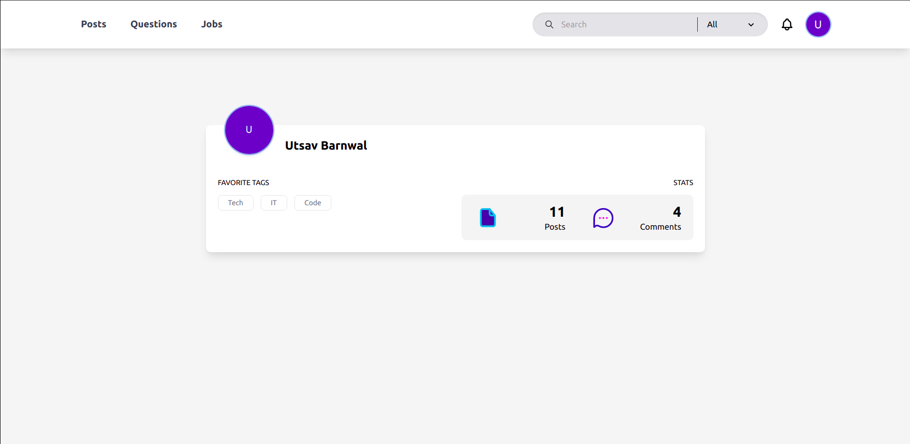
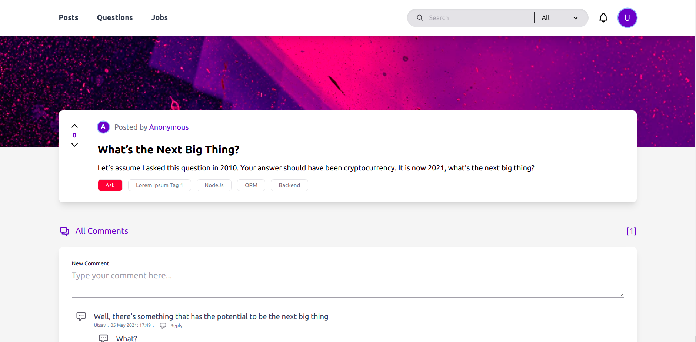
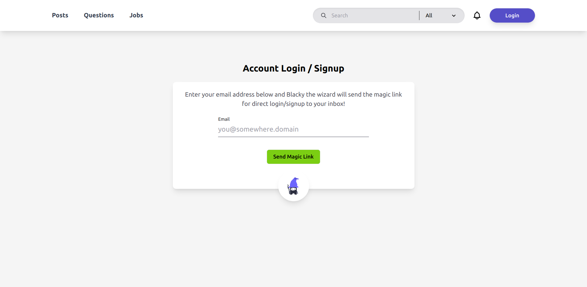
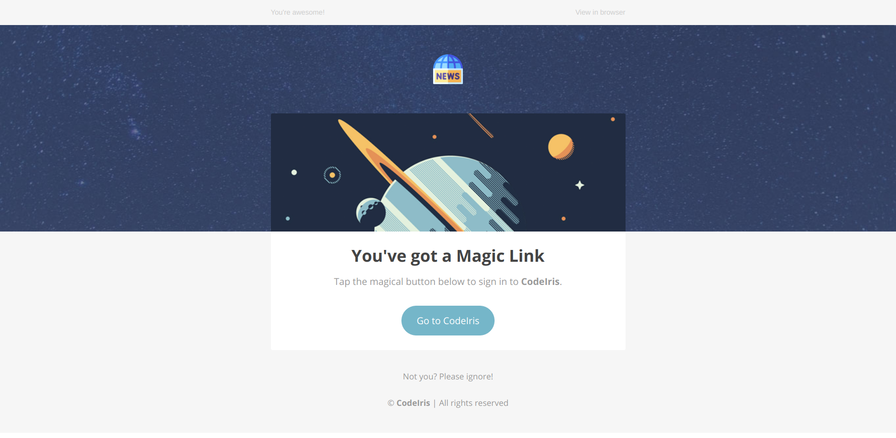

# CodeIris
`HackerNews` clone (just the functionality, promise UI/UX is better).

## Documentation
Click [here](https://www.notion.so/CodeIris-a3b904ef12dd424795f78e87a75e4a20) to see the full documentation for this project or directly see
- [Database](https://www.notion.so/Database-14be10fb2e5a47aaa7de117a23c638cb)
- [Roadmap](https://www.notion.so/0b1db2a45d994dd9a22ee55b17f2fed8?v=cb4daf4b8df24dc89d7a1762d4503d29)
- [Techs Used](https://www.notion.so/Techs-b84007046f514721bb01e1c71d52b1e6)
- [Design Mocks](https://www.notion.so/Mocks-4cdc910ac3754285aae48db4b08b1217)

## Motivation
This project was built as the deep-dive project from [Pesto Tech](https://pesto.tech). 

## Samples
Following images are linked to their full size

<a href="./samples/desktop/home.png">
  
</a>

<a href="./samples/desktop/create-post.png">
  
</a>

<br/>
<br/>

<a href="./samples/desktop/profile.png">
  
</a>

<a href="./samples/desktop/post.png">
  
</a>

<br/>
<br/>

<a href="./samples/desktop/login.png">
  
</a>

<a href="./samples/desktop/email.png">
  
</a>

## Technologies Used
| Front-end | Back-end | Hosting | Others
| - | - | - | - |
| ReactJS | NodeJS | GCS | SharpJS |
| NextJS | NestJS | AWS | Lottie |
| Tailwind | Prisma |  | Sentry |
| Apollo | GraphQL |  | Storybook |
| MobX |  |  |  |
| SASS |  |  |  |

## Installation
Run the dev build

```bash
yarn dev
```

## Deployment
**Production:** https://codeiris.dev/  
**Developement:** https://dev.codeiris.dev/

## Features
- **Password less Login and Signup:** User should be able to login with using their email address (Magic Link)
  
- **Link Posts:** User should be able to create link posts and add tags.

- **Ask HN Posts:** User should be able to create Ask HN post and add tags

- **Job Posting:** Users can post their job and add tags

<!--- **Can edit and delete their own posts:** User can edit and delete their own posts. Deleting posts won't delete the comments or replies on that post.-->

- **Real time replies with multi-level comments:** User should be able to reply and other users wherever they are should be able to see the reply immediately ( Use WebSockets or Pusher or SSE)

<!--- **Reply notifications:** When a user's post is replied by someone they should get a notification on bell icon and through email.

- **Email Digest of Top posts, Top Ask HN, Top Jobs:** Users should be able to receive a daily email digest that has information of top posts, top ask HN posts and top job postings.-->

- **Filter by tags:** User should be able to filter by tag.

- **Sort by Published date:** User should be able sort posts by published date with in the page (expecting client side sorting, feel free to have server side sorting)

- **Sort by top votes:** User should be able to sort by top votes (expecting client side sorting, feel free to have server side sorting)

- **Full Text Search:** User should be able to do full text search on all posts and comments in the database. ([Meilisearch](https://www.meilisearch.com/))

<!--- **Filter by date range:** User should be able to filter using a date range.-->

- **Pagination for posts:** User should be able to go to next page using pagination navigation

- **Lazy loading for discussions:** Discussions on post should load lazily

<!--- **Flag Inappropriate posts:** Users with role of Moderators can flag discussions when they are inappropriate.

- **Flag Inappropriate users:** Users with role of Moderators can flag users when they are creating inappropriate posts.

- **Admin can Delete and edit any posts:** User with role of admin can delete posts if they are inappropriate and edit posts if they want to. They can also delete and edit flagged posts.

- **Admin can disable users:** User with role of admin can disable a user if they create inappropriate posts and flagged users

- **Anonymous:** Users can write a thread or post comments without creating any account-->

## Credits
- Instructor: Naquiuddin Khaja
- Instructor: Satyam Bansal